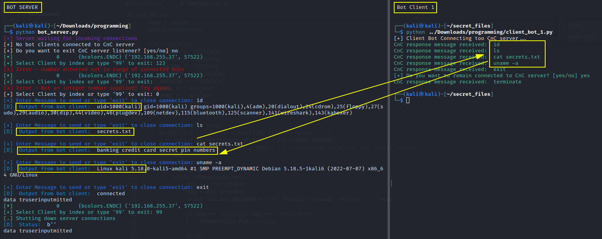

# Python Server & Client Proof of Concept - Command-and-control

The two Python scripts together are a proof of concept to demo how a client bot execute commands on victim workstation and sending info to C2 server.

This will not pass any SIEM or security controls but it is example of what can be done.

In the below screenshot, the server is listen for incoming bot client connections.
The server on the left send commands to the bot client on the right.
The output results are send back to the server on the left.

A botnet's originator (known as a "bot herder" or "bot master") controls the botnet remotely. 
This is known as the command-and-control (C&C). The program for the operation must communicate via a covert channel to the client on the victim's machine (zombie computer).
